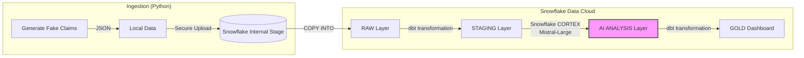

# 🕵️‍♂️ Auto-Claim Investigator

Pipeline d'Analyse de Sinistres Automatisé par GenAI (Snowflake Cortex)

# 🎯 Vision du Projet

Ce projet démontre comment moderniser le traitement des sinistres automobiles en transformant des données non structurées (récits d'accidents en texte libre) en décisions métier structurées (responsabilité 0%, 50%, 100%) grâce à l'IA Générative intégrée au Data Warehouse.

## Objectif Business :

- Réduire le temps de lecture des constats amiables.

- Standardiser la prise de décision sur la responsabilité.

- Détecter les anomalies via un scoring automatique.

# 🏗 Architecture Technique

Le pipeline suit une architecture ELT moderne (Extract, Load, Transform) orchestrée par dbt et propulsée par Snowflake.



# 🛠 La Stack

- Infrastructure : Snowflake (Standard Edition).

- Transformation : dbt Core (v1.7) avec adaptateur Snowflake.

- Intelligence Artificielle : Snowflake Cortex (Fonctions LLM Serverless : COMPLETE).

- Langage : SQL (90%), Python (Génération de données & Ingestion), Jinja.

- Documentation : dbt Docs.

# 🧠 Focus : L'IA au service du Métier

Le cœur du projet réside dans l'utilisation de Snowflake Cortex pour analyser le texte. Aucune sortie de données hors de la plateforme n'est nécessaire (Sécurité & Gouvernance).

## Exemple de Prompt Engineering (SQL) :

```sql
SELECT 
    claim_id,
    accident_description,
    SNOWFLAKE.CORTEX.COMPLETE(
        'mistral-large', 
        CONCAT(
            'Tu es un expert en assurance. Analyse le constat suivant. ',
            'Détermine la responsabilité du narrateur (0, 50, 100). ',
            'Récit : ', accident_description
        )
    ) AS ai_verdict
FROM staging.claims;
```

**Résultat de la transformation :**

| Input (Non structuré) | Output IA (Structuré) |
| :--- | :--- |
| *"Je suis sorti de mon stationnement et j'ai heurté le véhicule B."* | **100% Responsable** |
| *"J'étais à l'arrêt au feu rouge, on m'a percuté par l'arrière."* | **0% Responsable** |

# 🚀 Installation & Démarrage

### Pré-requis

- Python 3.10+

- Compte Snowflake avec accès Cortex activé.

## 1. Cloner et Configurer

```Bash

git clone https://github.com/VOTRE_USER/auto-claim-investigator.git
cd auto-claim-investigator
pip install -r requirements.txt 2. Sécurité (.env)
Créez un fichier .env à la racine (ne jamais commiter les crédentials !) :

SNOWFLAKE_ACCOUNT=ORG-ACCOUNT
SNOWFLAKE_USER=votre_user
SNOWFLAKE_PASSWORD=votre_mdp
SNOWFLAKE_WAREHOUSE=COMPUTE_WH
SNOWFLAKE_DATABASE=INSURANCE_DB 3. Exécution du Pipeline
```

## 2. Générer et Ingérer les données (Python)

```Bash
cd scripts
python generate_fake_claims.py
python ingest_data.py
```

## 3. Transformer et Analyser (dbt)

```Bash
cd ../dbt_claims
dbt run
```

# 📊 Documentation & Lineage

```Bash
dbt docs generate
dbt docs serve
```

# 👤 Auteur

Antoine - Data Engineer / Tech Lead

Projet réalisé dans le cadre d'un Proof of Concept (POC) technique démontrant l'intégration de l'IA Générative dans les workflows Data Engineering modernes.
